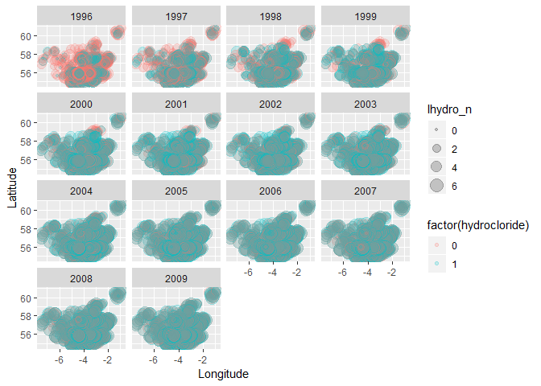

BPH - Exploratory analysis
================
Federico Andreis
18 September 2018

Data in
-------

Load the data and create a reduced version of the dataset with outcome grouped by *hydrocloride*

``` r
df <- read.csv('Data/df.csv')

dr <- df %>% group_by(gp_code,year,hydrocloride) %>% slice(1) %>% 
  ungroup %>% dplyr::select(-one_of('drug')) %>% mutate(lhydro_n=log(hydro_n))
```

Let's take an overall look at the data
--------------------------------------

Show temporal trends in prescription by hydrocloride.

``` r
dr %>% ggplot(aes(x=year,y=lhydro_n,group=hydrocloride,
                  col=factor(hydrocloride)))+
  geom_smooth()+theme_bw()
```

    ## `geom_smooth()` using method = 'gam' and formula 'y ~ s(x, bs = "cs")'

 Show spatial trends faceted by year.

``` r
dr %>% ggplot(aes(Longitude, Latitude, size = hydro_n, colour = hydrocloride)) +
  geom_point(alpha = 0.7, show.legend = FALSE) +
  facet_wrap(~year)
```



Show the GP positions.

``` r
map_scotland <- readOGR('Data/Scotland boundary.shp')
```

    ## OGR data source with driver: ESRI Shapefile 
    ## Source: "C:\Users\fa15\Dropbox\Stirling\Research\Ashleigh Ward\BPH\bph\Data\Scotland boundary.shp", layer: "Scotland boundary"
    ## with 1 features
    ## It has 1 fields

``` r
plot(map_scotland)
dr_map <- dr
coordinates(dr_map) <- ~Easting+Northing
plot(dr_map,add=TRUE,col='red')
```


Models
------
