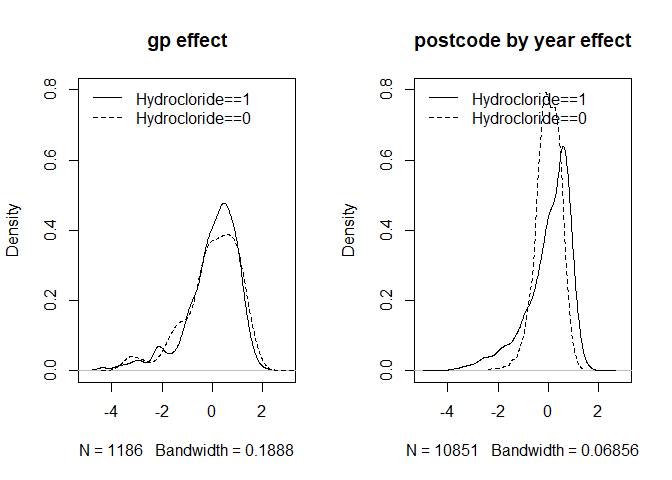
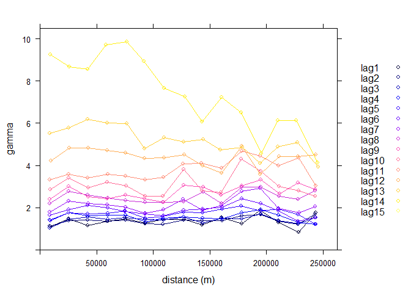

BPH - Exploratory analysis
================
Federico Andreis
18 September 2018

Data in
-------

Load the data and create a reduced version of the dataset with outcome grouped by *hydrocloride*

``` r
df <- read.csv('Data/df.csv')

dr <- df %>% group_by(gp_code,year,hydrocloride) %>% slice(1) %>% 
  ungroup %>% dplyr::select(-one_of('drug')) %>% mutate(lhydro_n=log(hydro_n))
```

Let's take an overall look at the data
--------------------------------------

Show temporal trends in prescription by hydrocloride.

``` r
dr %>% ggplot(aes(x=year,y=lhydro_n,group=hydrocloride,
                  col=factor(hydrocloride)))+
  geom_smooth()+theme_bw()
```

    ## `geom_smooth()` using method = 'gam' and formula 'y ~ s(x, bs = "cs")'

 Show spatial trends faceted by year. \[**pretty useless as is**\]

``` r
dr %>% ggplot(aes(Longitude, Latitude, size = lhydro_n, colour = factor(hydrocloride))) +
  geom_point(alpha = 0.2) +
  facet_wrap(~year)
```


Show the GP positions.

``` r
map_scotland <- readOGR('Data/Scotland boundary.shp')
```

    ## OGR data source with driver: ESRI Shapefile 
    ## Source: "C:\Users\fa15\Dropbox\Stirling\Research\Ashleigh Ward\BPH\bph\Data\Scotland boundary.shp", layer: "Scotland boundary"
    ## with 1 features
    ## It has 1 fields

``` r
plot(map_scotland)
dr_map <- dr
coordinates(dr_map) <- ~Easting+Northing
plot(dr_map,add=TRUE,col='red')
```


Models
------

We wish to investigate the existence of a spatiotemporal component predictive of inequalities in the number of drug prescriptions. We do so stratifying by hydrocloride group. In order to do so, we begin by fitting two separate simple mixed log-linear models for `hydrocloride==1` and `hydrocloride==1`.

### Separate models for the two groups

The random effects under consideration are a gp effect and a postcode×year effect \[**gp is, de facto, nested within postcode... is this going to cause problems here?**\]. We first define a postcode×year label and log-transform the outcome. Also, build two separate dataframes for the two groups, for simplicity.

``` r
dr_mod <- dr %>% mutate(postcode_year=paste(POSTCODE,year),
                        lhydro_n=log(hydro_n))
dr1 <- dr_mod %>% filter(hydrocloride==1)
dr0 <- dr_mod %>% filter(hydrocloride==0)
```

Fit the log-linear model for the hydrocloride group with and without the random effects

``` r
mod_hydro1 <- lmer(lhydro_n~(1|gp_code)+(1|postcode_year),
                   data=dr1,REML = FALSE)
mod_hydro1_null <- glm(lhydro_n~1,
                   data=dr1)
mod_hydro1_gp <- lmer(lhydro_n~1+(1|gp_code),
                        data=dr1,REML = FALSE)
mod_hydro1_py <- lmer(lhydro_n~1+(1|postcode_year),
                        data=dr1,REML = FALSE)
```

and cross-compare them

``` r
anova(mod_hydro1,mod_hydro1_null)
```

    ## Data: dr1
    ## Models:
    ## mod_hydro1_null: lhydro_n ~ 1
    ## mod_hydro1: lhydro_n ~ (1 | gp_code) + (1 | postcode_year)
    ##                 Df   AIC   BIC logLik deviance  Chisq Chi Df Pr(>Chisq)
    ## mod_hydro1_null  2 49707 49722 -24852    49703                         
    ## mod_hydro1       4 41936 41967 -20964    41928 7774.8      2  < 2.2e-16
    ##                    
    ## mod_hydro1_null    
    ## mod_hydro1      ***
    ## ---
    ## Signif. codes:  0 '***' 0.001 '**' 0.01 '*' 0.05 '.' 0.1 ' ' 1

``` r
anova(mod_hydro1,mod_hydro1_gp)
```

    ## Data: dr1
    ## Models:
    ## mod_hydro1_gp: lhydro_n ~ 1 + (1 | gp_code)
    ## mod_hydro1: lhydro_n ~ (1 | gp_code) + (1 | postcode_year)
    ##               Df   AIC   BIC logLik deviance  Chisq Chi Df Pr(>Chisq)    
    ## mod_hydro1_gp  3 45432 45455 -22713    45426                             
    ## mod_hydro1     4 41936 41967 -20964    41928 3497.5      1  < 2.2e-16 ***
    ## ---
    ## Signif. codes:  0 '***' 0.001 '**' 0.01 '*' 0.05 '.' 0.1 ' ' 1

``` r
anova(mod_hydro1,mod_hydro1_py)
```

    ## Data: dr1
    ## Models:
    ## mod_hydro1_py: lhydro_n ~ 1 + (1 | postcode_year)
    ## mod_hydro1: lhydro_n ~ (1 | gp_code) + (1 | postcode_year)
    ##               Df   AIC   BIC logLik deviance  Chisq Chi Df Pr(>Chisq)    
    ## mod_hydro1_py  3 48393 48415 -24193    48387                             
    ## mod_hydro1     4 41936 41967 -20964    41928 6458.1      1  < 2.2e-16 ***
    ## ---
    ## Signif. codes:  0 '***' 0.001 '**' 0.01 '*' 0.05 '.' 0.1 ' ' 1

Similarly, for the non-hydrocloride group:

``` r
mod_hydro0 <- lmer(lhydro_n~(1|gp_code)+(1|postcode_year),
                   data=dr0,REML = FALSE)
mod_hydro0_null <- glm(lhydro_n~1,
                       data=dr0)
mod_hydro0_gp <- lmer(lhydro_n~1+(1|gp_code),
                      data=dr0,REML = FALSE)
mod_hydro0_py <- lmer(lhydro_n~1+(1|postcode_year),
                      data=dr0,REML = FALSE)
anova(mod_hydro0,mod_hydro0_null)
```

    ## Data: dr0
    ## Models:
    ## mod_hydro0_null: lhydro_n ~ 1
    ## mod_hydro0: lhydro_n ~ (1 | gp_code) + (1 | postcode_year)
    ##                 Df   AIC   BIC logLik deviance Chisq Chi Df Pr(>Chisq)    
    ## mod_hydro0_null  2 44689 44704 -22342    44685                            
    ## mod_hydro0       4 34535 34565 -17264    34527 10157      2  < 2.2e-16 ***
    ## ---
    ## Signif. codes:  0 '***' 0.001 '**' 0.01 '*' 0.05 '.' 0.1 ' ' 1

``` r
anova(mod_hydro0,mod_hydro0_gp)
```

    ## Data: dr0
    ## Models:
    ## mod_hydro0_gp: lhydro_n ~ 1 + (1 | gp_code)
    ## mod_hydro0: lhydro_n ~ (1 | gp_code) + (1 | postcode_year)
    ##               Df   AIC   BIC logLik deviance  Chisq Chi Df Pr(>Chisq)    
    ## mod_hydro0_gp  3 36085 36107 -18039    36079                             
    ## mod_hydro0     4 34535 34565 -17264    34527 1551.3      1  < 2.2e-16 ***
    ## ---
    ## Signif. codes:  0 '***' 0.001 '**' 0.01 '*' 0.05 '.' 0.1 ' ' 1

``` r
anova(mod_hydro0,mod_hydro0_py)
```

    ## Data: dr0
    ## Models:
    ## mod_hydro0_py: lhydro_n ~ 1 + (1 | postcode_year)
    ## mod_hydro0: lhydro_n ~ (1 | gp_code) + (1 | postcode_year)
    ##               Df   AIC   BIC logLik deviance  Chisq Chi Df Pr(>Chisq)    
    ## mod_hydro0_py  3 44076 44099 -22035    44070                             
    ## mod_hydro0     4 34535 34565 -17264    34527 9542.9      1  < 2.2e-16 ***
    ## ---
    ## Signif. codes:  0 '***' 0.001 '**' 0.01 '*' 0.05 '.' 0.1 ' ' 1

Model summaries for the full models:

``` r
summary(mod_hydro1)
```

    ## Linear mixed model fit by maximum likelihood  ['lmerMod']
    ## Formula: lhydro_n ~ (1 | gp_code) + (1 | postcode_year)
    ##    Data: dr1
    ## 
    ##      AIC      BIC   logLik deviance df.resid 
    ##  41936.5  41966.7 -20964.2  41928.5    14038 
    ## 
    ## Scaled residuals: 
    ##     Min      1Q  Median      3Q     Max 
    ## -5.2636 -0.2179  0.0781  0.2836  3.1751 
    ## 
    ## Random effects:
    ##  Groups        Name        Variance Std.Dev.
    ##  postcode_year (Intercept) 1.0769   1.0378  
    ##  gp_code       (Intercept) 1.2480   1.1171  
    ##  Residual                  0.1854   0.4306  
    ## Number of obs: 14042, groups:  postcode_year, 10905; gp_code, 1186
    ## 
    ## Fixed effects:
    ##             Estimate Std. Error t value
    ## (Intercept)  4.33631    0.03491   124.2

``` r
summary(mod_hydro0)
```

    ## Linear mixed model fit by maximum likelihood  ['lmerMod']
    ## Formula: lhydro_n ~ (1 | gp_code) + (1 | postcode_year)
    ##    Data: dr0
    ## 
    ##      AIC      BIC   logLik deviance df.resid 
    ##  34535.2  34565.4 -17263.6  34527.2    13883 
    ## 
    ## Scaled residuals: 
    ##     Min      1Q  Median      3Q     Max 
    ## -5.1431 -0.3428  0.0423  0.4125  3.3056 
    ## 
    ## Random effects:
    ##  Groups        Name        Variance Std.Dev.
    ##  postcode_year (Intercept) 0.4013   0.6334  
    ##  gp_code       (Intercept) 1.2963   1.1385  
    ##  Residual                  0.2122   0.4606  
    ## Number of obs: 13887, groups:  postcode_year, 10851; gp_code, 1171
    ## 
    ## Fixed effects:
    ##             Estimate Std. Error t value
    ## (Intercept)  3.96705    0.03446   115.1

#### Model diagnostics

Residuals against time and space

``` r
pairs(cbind(dr1$year,dr1$Latitude,dr1$Longitude,residuals(mod_hydro1)),labels=c('year','latitude','longitude','residuals'),main='hydrocloride')
```


``` r
pairs(cbind(dr0$year,dr0$Latitude,dr0$Longitude,residuals(mod_hydro0)),labels=c('year','latitude','longitude','residuals'),main='non-hydrocloride')
```


There seems to be some heteroscedasticity in the residuals against both time and location. Now for the random effects part:

``` r
ranef_hydro1 <- ranef(mod_hydro1)
ranef_hydro0 <- ranef(mod_hydro0)

par(mfrow=c(1,2))
plot(density(ranef_hydro1$gp_code$`(Intercept)`),main='gp effect',
     xlim=c(-5,3),ylim=c(0,.8))
lines(density(ranef_hydro0$gp_code$`(Intercept)`),lty=2)
legend('topleft',box.lty = 0,bg=NULL,
       lty=1:2,legend=c('Hydrocloride==1','Hydrocloride==0'))

plot(density(ranef_hydro0$postcode_year$`(Intercept)`),lty=2,
     main='postcode by year effect',
     xlim=c(-5,3),ylim=c(0,.8))
lines(density(ranef_hydro1$postcode_year$`(Intercept)`))
legend('topleft',box.lty = 0,bg=NULL,
       lty=1:2,legend=c('Hydrocloride==1','Hydrocloride==0'))
```



``` r
par(mfrow=c(1,1))
```

While the gp effect seems to be substantially the same (overall) across the two groups, the time×space component shows a somewhat different behaviour. This may warrant both joint modelling of the two groups and inclusion of a spatiotemporal component. Next, we explore the spatial and temporal correlation features by means of variograms.

### Variograms

This part has been inspired by the tutorial on spatio-temporal kriging found [here](http://r-video-tutorial.blogspot.com/2015/08/spatio-temporal-kriging-in-r.html). We use the `spacetime` package to create an object of class `STIDF`, suitable for data over non-regular spatio-temporal grids. We do this initially stratifying by group. As the computations involved are quite heavy, we subsample the complete dataset (500 obs per group). \[**the subsampling does not retain any specific structure of the data, i.e., rows of the dataframe are sampled independently. We could improve over this but I'm not sure it would make a huge difference at this stage.**\]

#### Hydrocloride group

Create the `STIDF` object.

``` r
set.seed(42)
drr_mod <- dr_mod %>% 
  filter(hydrocloride==1) %>% 
  sample_n(500)

xy <- SpatialPoints(cbind(drr_mod$Easting,drr_mod$Northing))
proj4string(xy) <- CRS("+init=epsg:27700")
z <- as.POSIXct(drr_mod$time,tz = 'GMT')

st <- STIDF(xy,time=z,data.frame(y=drr_mod$lhydro_n))
```

Construct the empirical variogram

``` r
st_variogram <- variogramST(y~1,data=st,tunit='weeks',
                            tlags=52*0:15,
                            assumeRegular=FALSE,na.omit=T) 

par(mfrow=c(1,2))
plot(st_variogram,map=FALSE)
```



``` r
plot(st_variogram,wireframe=TRUE)
```


``` r
par(mfrow=c(1,1))
```

Fit variogram models

``` r
pars.l <- c(sill.s = 0, range.s = 10, nugget.s = 0,sill.t = 0, 
            range.t = 1, nugget.t = 0,sill.st = 0, range.st = 10, 
            nugget.st = 0, anis = 0)
pars.u <- c(sill.s = 200, range.s = 1000, nugget.s = 6,sill.t = 200, 
            range.t = 60, nugget.t = 6,sill.st = 200, range.st = 1000, 
            nugget.st = 6,anis = 700) 
# separable
separable <- vgmST("separable", 
                   space = vgm(-60,"Sph", 500, 1),
                   time = vgm(35,"Sph", 500, 1), sill=0.56) 
separable_Vgm <- fit.StVariogram(st_variogram, separable, fit.method=11,
                                      method="L-BFGS-B", stAni=5, 
                                      lower=pars.l,upper=pars.u)
attr(separable_Vgm, "MSE")
```

    ## [1] 6.778543

``` r
# product sum
prodSumModel <- vgmST("productSum",space = vgm(1, "Exp", 150, 0.5),
                      time = vgm(1, "Exp", 5, 0.5),k = 50) 
prodSumModel_Vgm <- fit.StVariogram(st_variogram, prodSumModel,
                                    method = "L-BFGS-B",lower=pars.l)
# metric
metric <- vgmST("metric", joint = vgm(50,"Mat", 500, 0), stAni=200) 
metric_Vgm <- fit.StVariogram(st_variogram, metric, 
                              method="L-BFGS-B",lower=pars.l)
# sum metric
sumMetric <- vgmST("sumMetric", space = vgm(psill=5,"Sph", range=500, nugget=0),
                   time = vgm(psill=500,"Sph", range=500, nugget=0), 
                   joint = vgm(psill=1,"Sph", range=500, nugget=10), stAni=500) 
sumMetric_Vgm <- fit.StVariogram(st_variogram, sumMetric, 
                                 method="L-BFGS-B",lower=pars.l,upper=pars.u,
                                 tunit="weeks")
# simple sum metric
SimplesumMetric <- vgmST("simpleSumMetric",space = vgm(5,"Sph", 500, 0),
                         time = vgm(500,"Sph", 500, 0), 
                         joint = vgm(1,"Sph", 500, 0), nugget=1, stAni=500) 
SimplesumMetric_Vgm <- fit.StVariogram(st_variogram, SimplesumMetric,
                                       method = "L-BFGS-B",lower=pars.l)
```

And now plot them all together, while providing a measure of goodness of fit (MSE).

``` r
plot(st_variogram,
     list(separable_Vgm, prodSumModel_Vgm, 
          metric_Vgm, sumMetric_Vgm, 
          SimplesumMetric_Vgm),all=T,wireframe=T,
     main='hydrocloride')
```


``` r
c(attr(separable_Vgm,'MSE'),
  attr(prodSumModel_Vgm,'MSE'),
  attr(metric_Vgm,'MSE'),
  attr(sumMetric_Vgm,'MSE'),
  attr(SimplesumMetric_Vgm,'MSE'))
```

    ## [1] 6.778543 3.182118 3.190066 3.024493 1.009352

#### Non-hydrocloride group


    ## [1] 0.8838116


    ## [1] 0.88381165 0.13587131 0.13625267 0.12817091 0.09083935
